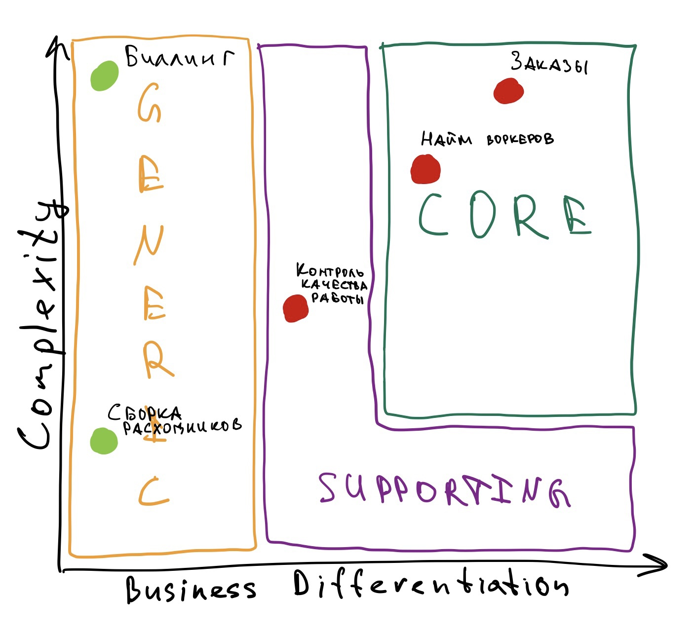
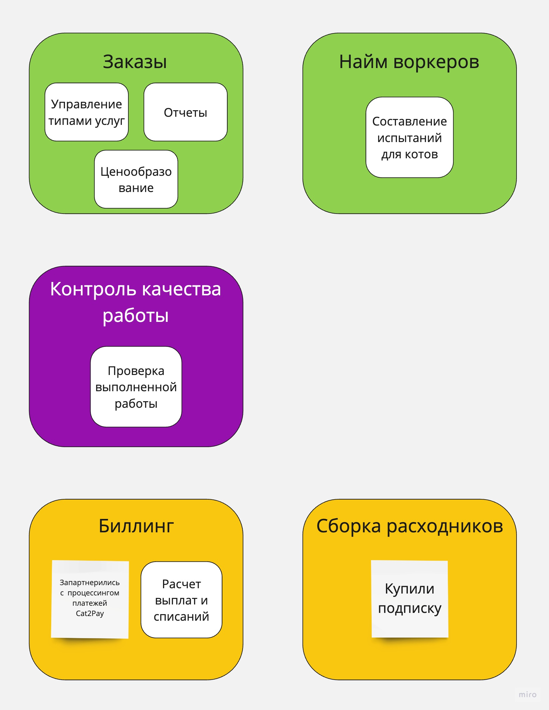

# Поддомены
Нашел такие поддомены:
- Найм воркеров
- Контроль качества работы
- Сборка расходников
- Контроль процесса заказа
- Биллинг

Ставки менеджеров не стал выделять в поддомен, потому что это слабо относится к цели бизнеса

Получилось так, что поддомены практически повторяют компоненты ES. Возможно на реальной системе получилось бы иначе

# Core domain chart

- **Найм воркеров**. Сложный процесс отбора, большая ценность для бизнеса, поскольку отбираем топ 3% котов. Поэтому `core`
- **Контроль качества работы**. Не rocket science, но при этом важная часть бизнеса, хотя и не что-то уникальное. Поэтому `supporting`
- **Сборка расходников**. Просто и не так важно для бизнеса + печеньки и так выпекаются на аутсорсе. Поэтому `generic` и отдаем на аутсорс
- **Контроль процесса заказа**. Выглядит сложным доменом и это основная ценность компании. Поэтмоу `core`
- **Биллинг**. Есть у всех компаний, поэтому `generic`. Можно частично купить готовое решение, потому что реализовывать весь биллинг с нуля очень дорого. Имеет смысл реализовать только специфичную для компании часть, а остальной процессинг платежей доверить другим

# Bounded contexts
Miro: https://miro.com/app/board/uXjVMIWi79I=/?moveToWidget=3458764555218713326&cot=14

- В биллинге выделил купленное решение и внутренний расчет выплат, чтобы показать, что внутри все равно нужен кто-то для поддержания системы
- В заказах показалось логичным выделить несколько контекстов, поскольку это большая система

# Что изменилось по сравнению с изначальной ES
1. Компонент заказов разбился на 3
2. Исчез компонент со ставками менеджеров
3. **Больше ничего не поменялось :/ Не могу понять почему, возможно недостаточно глубоко копнул и слишком сильно опирался на изначальный ES**
