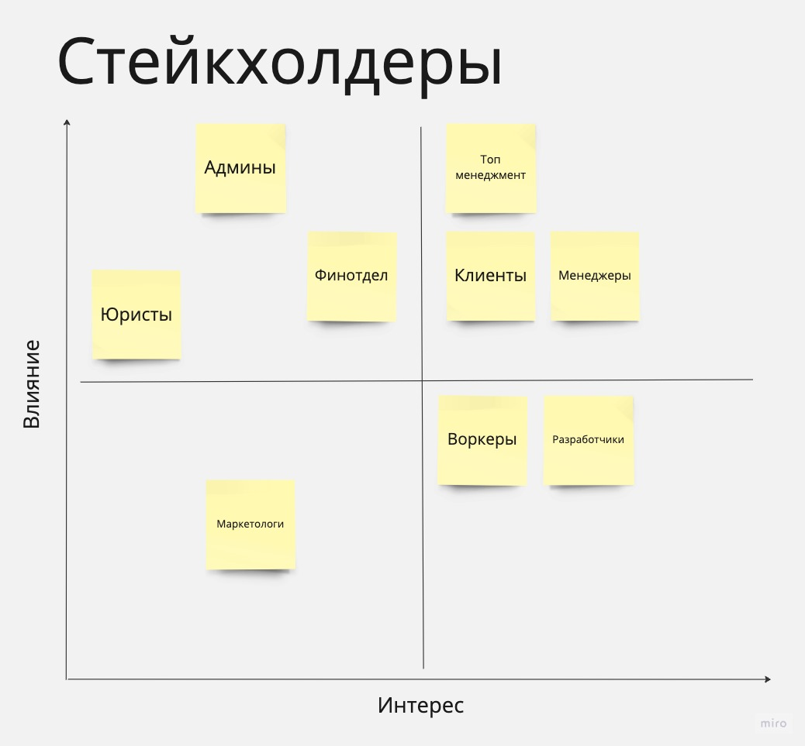

# Стейкхолдеры

Оригинал: https://miro.com/app/board/uXjVMIWi79I=/?moveToWidget=3458764555823598790&cot=14

1. Не стал выделять людей, связанных со складом в отдельных стейкхолдеров, потому что это решение на аутсорсе. Хотя с другой стороны они тоже влияют на технологии компании и задают ограничения
2. Разработчиков отнес к категории тесной работы, потому что они влияют на все технические системы в компании и имеют высокую заинтересованость
3. Воркеров положил в информирование, потому что это сорее наемные работники, не сильно вовлеченные в бизнес процессы
4. Менеджеры кажется весьма заинтересованы в успехе проекта, поэтому их определил в тесную работу

